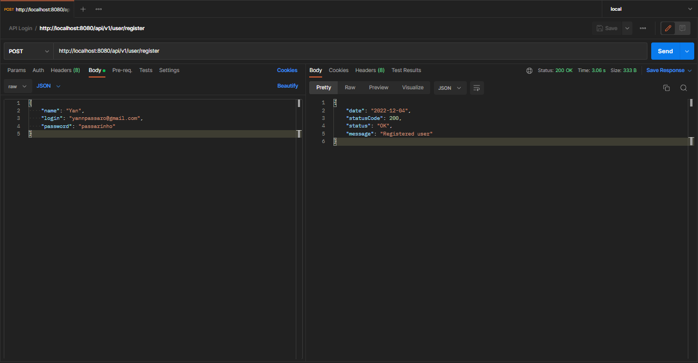
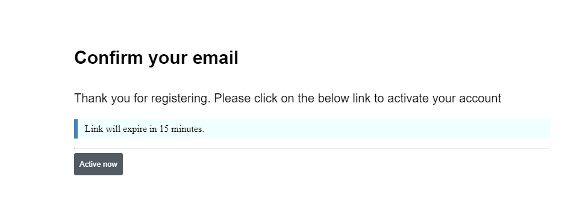

# LOGIN API

Login and registration system with email verification and token authentication.

### Features

- [x] User registration
- [x] Enter
- [X] Single Token Authentication
- [X] Send confirmation in email

# Getting started

These instructions will get you a copy of the full project up and running on your local machine for development and testing purposes.

For the project, java version 17 was used. [install](https://www.oracle.com/java/technologies/javase/jdk17-archive-downloads.html)

The dependency installer used was Mavem, the versions used for each dependency are in the [#POM](./pom.xml).

Recommended to use [Intellij IDE](https://www.jetbrains.com/idea/).

## Database configuration

The project uses [PostgreSQL](https://www.postgresql.org) and [Redis](https://redis.io/).

I recommend using Docker to install and run the above databases and services.

## How to install

	git clone https://github.com/yangt21/api-login
	cd api-login

## How to configure

> Create an .env file in the root of the project.

> Insert in the .env the database and email credentials that will be used according to the [application.properties](./src/main/resources/application.properties)

> If necessary modify the url of the smtp service

> Right after configure the profile that will be used in the application startup for the dev profile

#### Go to	

	http://localhost:8080/api/v1/user/register

## HTTP EndPoints

| Method | Endpoint              | Function                   | Return       |
|--------|-----------------------|----------------------------|--------------|
| POST   | /api/v1/user/register | register a new user        |              |
| GET    | /api/v1/user/confirm  | confirm email verification |              |
| GET    | /api/v1/user/profile  | view user profile          | user profile |
| POST   | /api/v1/user/login    | login                      | user token   |
| PUT    | /api/v1/user/update   | update user                |              |
| DELETE | /api/v1/user/delete   | delete user                |              |
    
## Screenshoots

#### Email confirmation

  
## References

+ [Spring Documentation](https://docs.spring.io/spring-boot/docs/current/reference/html/)
+ [PostgreSQL Documentation](https://www.postgresql.org/docs/)
+ [Redis Documentation](https://redis.io/docs/)

